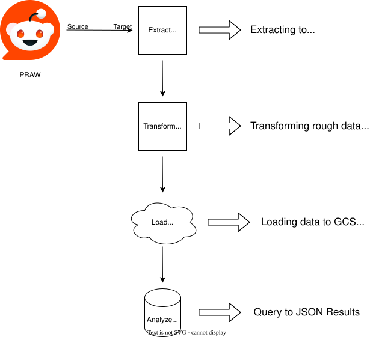

# REDDIT DATA PIPELINE USING GCP 

This personal project showcases entire data pipeline for Reddit's hottest posts of single subreddit using **PRAW (Public Reddit API Wrapper)**, **Python**, **Apache Airflow**, **Docker** and **GCP Cloud Storage and BigQuery**. It is broken down into single ETL steps and scheduled using **Apache Airflow** and finally loaded on **BigQuery** DW for analysis.

---
## Technologies Used
- Python  
- NumPy    
- Docker  
- Apache Airflow
- GCP
- Numpy
- Pandas
---

## Folder Structure
 - docker/ – Airflow setup, logs, and plugins
  
 - dags/ - DAG python files for extract, transform and load
  
 - data/ – Pulled reddit data in json
  
 - scripts/ – Python ETL testing scripts

 - sql/ - SQL scripts for BigQuery DW
  
 - notebook/ - Jupyter notebooks for analysis of the dataset
  
 - visuals/ - Visualizing the insights and saving it's images
  
 - .gitignore – Files to ignore in Git
  
 - README.md – This file

---

### Architecture



---

### Getting Started: Deployment Guide

#### 1. Clone the Repository
```bash
git clone https://github.com/your-username/reddit-data-pipeline.git
cd reddit-data-pipeline
```
#### 2. Set Up Python Environment
```bash
python -m venv venv
source venv/bin/activate  # or venv\Scripts\activate on Windows
pip install -r requirements.txt
```

#### 3. Get Reddit API (PRAW) access
1) Go to [https://www.reddit.com/prefs/apps]
2) Login or Sign up to a Reddit account
3) Create an app and name it accordingly
4) Select script (for personal use) in the radio under name
5) Add in redirect uri, for e.g. [http://localhost:8081]
6) Finish the captcha and create your app
7) The secret is your secret key for your .env, the client id is under personal use script

#### 4. Create .env File
Make a .env file in the root directory and add:

``` env
REDDIT_CLIENT_ID=your_id
REDDIT_CLIENT_SECRET=your_secret
API_USERNAME=your_reddit_username
API_PASSWORD=your_reddit_password
REDDIT_USER_AGENT=your_agent
PROJECT_ID=your_gcp_project_id
DATASET_ID=reddit_dataset
TABLE_ID=reddit_data
BUCKET_NAME=reddit-data-yourname
```

#### 5. Set Up Google Cloud

  - Download your Google Cloud service account JSON key file with permissions for BigQuery and Cloud Storage.

  - Save the JSON file inside the data/ folder of the project (e.g., data/gcp-credentials.json).

  - Add the following line to your .env file to point to this file:
      ``` GOOGLE_APPLICATION_CREDENTIALS=./data/gcp-credentials.json ```
  
  - This environment variable allows the Google Cloud client libraries to authenticate your API requests automatically.


  - Enable BigQuery and Cloud Storage APIs

  - Create a bucket named reddit-data-yourname

  - Create a BigQuery dataset named reddit_dataset

  - Grant necessary service account permissions (Storage Admin, BigQuery Admin)

#### 6. Launch Airflow
```bash
docker-compose up airflow-init
docker-compose up
```
Then go to localhost:8080 and trigger extract_reddit_dag.

## Usage

- Trigger the DAGs via Airflow UI at http://localhost:8080
- Check logs in the Airflow UI for debugging
- Processed data is available in BigQuery dataset `reddit_dataset`

## Contributing

Feel free to fork, open issues, and submit PRs. Please follow the existing code style.

## Troubleshooting

- If you get API errors, verify your Reddit credentials in `.env`
- Ensure GCP service account has correct permissions

## License

MIT License © Vinit